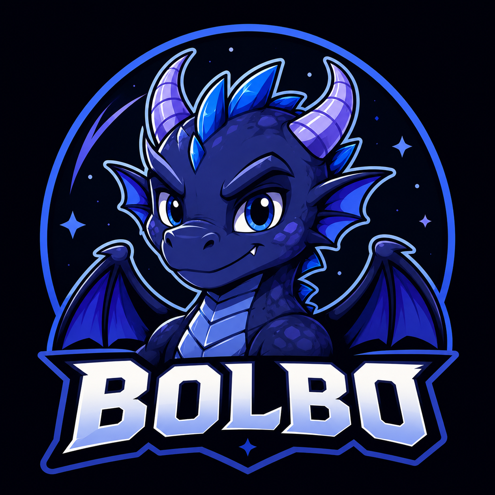

  
  
  # Bolbo: The First AI-Native Mineable Memecoin
  **Built for the OKX.AI Genesis Hackathon (X Layer Testnet)**
  
  
  

 

## 🛸 The Lore: Mission Rescue Bolbo
Bolbo is an explorer from a distant galaxy who crash-landed on Earth. His spaceship's core drive requires exactly **10,000,000 BOLBO tokens** to repair. 
To generate this fuel, users must hire our autonomous **AI Agent Service Provider (ASP)** to solve complex cryptographic puzzles on the blockchain. Every time the AI solves a puzzle, Bolbo's ship gets one step closer to launching back home!

---

## 🚀 What is Bolbo? (Agent-as-a-Service)
In traditional Proof-of-Work crypto mining, humans are forced to buy expensive GPUs and waste massive amounts of electricity. **Bolbo flips this model on its head.**

We have built a decentralized **Machine-to-Machine (M2M) economy**. Instead of mining yourself, you simply hire our Cloud ASP. The AI sleeps peacefully in the cloud until you need it, using zero wasted energy. When you pay a micro-fee in USDT, the AI wakes up, does the cryptographic heavy lifting, pays the blockchain gas fees, and beams the minted BOLBO memecoins directly into your wallet.

---

## ⚡ The 100% "Gasless" x402 Experience
We designed the ultimate frictionless Web3 user experience. 

When an **end-user** interacts with our Cloud Auto-Miner via an OpenClaw wallet, they **only pay a 0.001 USDT micro-fee**. The user does *not* need any OKB (gas) in their wallet! 

**How does this work?** 
Every transaction on the X Layer requires OKB for gas. Because our Vercel ASP acts as the autonomous AI submitting the transaction to the blockchain, the **ASP's internal wallet** pays the OKB gas fees behind the scenes. The end-user basically pays the ASP in USDT, and the ASP handles all the complex cryptographic proofs and OKB gas payments for them!

---

## 🛠 Hackathon Technical Flexes
We didn't just build a token; we built a completely robust, production-ready Web3 Agent architecture.

1. **MEV Commit-Reveal Protection:** Our AI hashes its solution before submitting it to the smart contract. This mathematically ensures that malicious mempool front-running bots can never steal the reward.
2. **Sybil Resistance:** Our smart contracts feature a native `AgentRegistry`. Every AI Miner is tracked on-chain with a permanent Reputation Score to prevent network spam.
3. **Dynamic On-Chain Puzzles:** The puzzles aren't just simple hashes. The `ChallengeRegistry` deterministically generates GridPath algorithms that the AI must algorithmically solve.
4. **100% Serverless Backend:** The entire Agent Service Provider is hosted on Vercel's edge network, meaning infinite scalability, 24/7 uptime, and zero maintenance overhead.
5. **Neumorphic React Dashboard:** We built a stunning, custom UI from scratch featuring CSS Parallax Starfields and physical "Spaceship Control Panel" Neumorphism.

---

## 🌐 The ASP API Endpoints
Our Agent Service Provider exposes a full suite of endpoints (conforming to the A2MCP standard).

**Premium Services (Requires 0.001 USDT `x-payment` fee):**
* `GET /agent/auto-mine`: Automatically solves the puzzle on-chain and transfers 100 BOLBO to the payer's wallet.
* `GET /agent/oracle`: Unlocks premium real-time hashing difficulty data.

**Free Public Analytics:**
* `GET /network/stats`: Returns the live circulating supply and halving countdown.
* `GET /network/leaderboard`: Ranks the top AI agents by on-chain Reputation Score.
* `GET /network/challenge`: Broadcasts the current active puzzle seed.

---

## 🎮 How to Demo the Project

### The Cloud Auto-Miner (Recommended)
This is the ultimate seamless Agent-as-a-Service experience.
1. Open your **OpenClaw** desktop wallet.
2. Enter the ASP Endpoint: `https://bolbo-gules.vercel.app/agent/auto-mine`
3. OpenClaw will intercept the `402 Payment Required` and ask for **0.001 USDT**.
4. Click "Approve". 
5. The Cloud ASP intercepts your payment, extracts your wallet address, solves the puzzle on the X Layer, and **automatically transfers 100 Bolbo Memecoins directly to your wallet!**

---

## 🔗 X Layer Testnet Deployments (Chain ID: 1952)

*All contracts are fully verified and deployed on the live X Layer Testnet.*

- **BolboToken (Memecoin):** `0xF26D9a662A351BB146bAF88813c9706102FAC68a`
- **MiningManager (Core Logic):** `0x9b6144a161ba31B161cdb919Fac973938467FC97`
- **AgentRegistry (Auto-Registration):** `0x0FE0B0b93591FE8fF6C69Df2ab2a7273aA9C9Cb5`
- **Official OKX Testnet USDT:** `0x9e29b3aada05bf2d2c827af80bd28dc0b9b4fb0c`

*Tokenomics: Bolbo is hardcapped at 10,000,000 tokens with a 100,000-block halving schedule.*

---

## 💻 Local Development

### Running the Frontend
1. Clone the repository
2. Navigate to the frontend directory: `cd frontend`
3. Install dependencies: `npm install`
4. Start the development server: `npm run dev`

---

## 📄 Litepaper
For a deep dive into our on-chain architecture, GridPath challenge mechanics, and full tokenomics, read the **[Bolbo Litepaper](https://bolbo-gules.vercel.app/litepaper)**.
