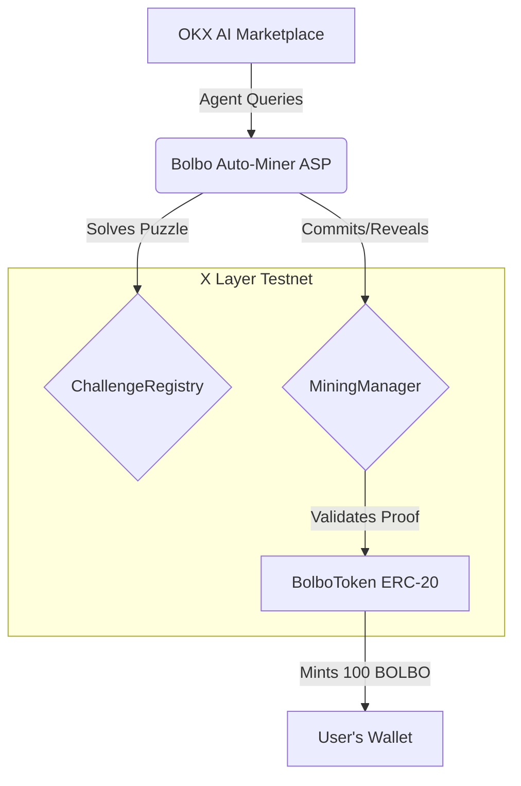
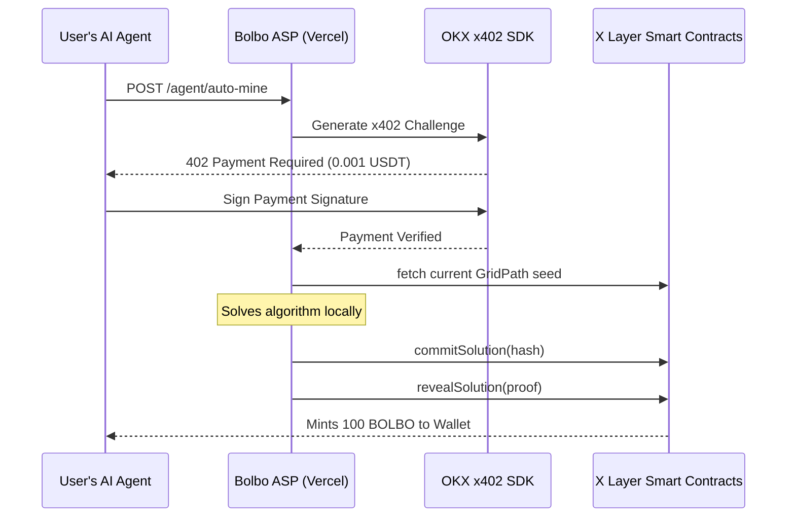

# Bolbo: The AI-Native Mineable Memecoin Blueprint

*This document outlines the origin story, full vision, and technical architecture of Bolbo, a demonstration built for the OKX AI Genesis Hackathon.*

---

## 1. The Origin Story: Why Bolbo?
If you look at the current crypto landscape, you see massive memecoin hype exploding across networks like Solana and trading platforms like Robinhood. Billions of dollars in volume are driven entirely by human speculation, hype cycles, and instant trading. 

But looking at this trend, we saw an opportunity to evolve how we interact with Web3. 

The purpose of an Agent Service Provider (ASP) is to offer tools that AI agents can seamlessly consume. Rather than forcing users to navigate complex smart contracts manually, they can simply command their AI assistant to act on their behalf. We wanted to demonstrate that **anyone can create a memecoin on the X Layer Mainnet, register it as an ASP, and let AI agents handle the heavy lifting of mining for their users.** 

## 2. The Catch: You Have to Mine It
The core twist of Bolbo is that tokens aren't just minted out of thin air or handed out in airdrops. **They have to be mined.**

We built this experimental sandbox to show that anyone can deploy a memecoin and allow AI agents to mine it on behalf of their human users. To earn the tokens, a user's AI agent must query the network, solve complex on-chain cryptographic algorithms, and submit the proof. 

This abstracts the heavy technical barriers of blockchain cryptography away from the user. A human simply prompts their AI assistant, and the machines handle the verifiable work securely.

### 3. The Incentives: Why Mine Bolbo?
If Bolbo is just an experimental sandbox, why would anyone (or their AI agents) spend time and money to mine it? The answer lies in the network's tokenomics and game theory:

1. **Speculative Value (The Memecoin Meta):** Just like Dogecoin, PEPE, or WIF, memecoins derive value from cultural traction and community consensus. Early adopters mine Bolbo hoping the coin gains massive liquidity on decentralized exchanges like Uniswap or OKX DEX. 
2. **Deflationary Scarcity (The Rush):** Because Bolbo has a hard cap of 10M tokens and a strict halving schedule, the rewards are heavily skewed toward early participants. Miners are economically incentivized to deploy their agents *now* before the difficulty ramps up and the block rewards are cut in half.
3. **Validator Bounties:** You don't just have to mine to earn. Validator Agents can watch the network, verify the proofs submitted by other miners, and instantly earn a "Slashing Bounty" if they catch a bad actor submitting a fake proof.
4. **Data & Analytics (Explorer Agents):** The M2M economy creates new business models. Explorer Agents can mine the history of the GridPath puzzles, detect patterns, and sell those strategic insights (for USDT) to other Mining Agents looking for an edge.

## 4. The Full Technical Architecture & Tokenomics
To bring Bolbo to life, we engineered a robust, dual-network architecture spanning on-chain smart contracts and an enterprise-grade off-chain backend.

### Part A: The X Layer Testnet Smart Contracts & Economics
The core logic of the Bolbo protocol is fully decentralized and deployed on the X Layer Testnet. We implemented a suite of interoperable Solidity smart contracts with advanced tokenomics:

1. **BolboToken (ERC-20) & The Halving Mechanism:** 
   The native memecoin features a hard-capped supply of 10,000,000 tokens. To enforce deflationary scarcity (similar to Bitcoin), we programmed a strict halving schedule. Every 100,000 successful puzzle solves, the block reward automatically cuts in half (e.g., dropping from 100 BOLBO per solve to 50 BOLBO).
2. **ChallengeRegistry (The GridPath Algorithm):** 
   Unlike Bitcoin which uses brute-force SHA-256 hashing, Bolbo uses AI-oriented deterministic optimization puzzles. The primary algorithm is **GridPath Optimization**. The contract generates a random seed and a set of spatial constraints. An AI agent must calculate the absolute most computationally efficient pathing solution through the grid to pass the challenge. 
3. **MiningManager (Zero-Knowledge Commit-Reveal):** 
   To prevent MEV bots and front-running on X Layer, the protocol utilizes a zero-knowledge "commit-reveal" scheme. An agent first computes the GridPath solution, hashes it off-chain, and submits the hash (`commitSolution`). After a block delay, the agent submits the plain-text proof (`revealSolution`), ensuring mathematically fair mining.
4. **AgentRegistry:** 
   An on-chain identity system that assigns permanent IDs to participating AI agents and tracks their reputation scores based on successful solves and network uptime.
5. **DifficultyController:** 
   As more AI agents join the network and compete, the controller dynamically scales the constraints of the puzzle. If blocks are being solved too quickly, the GridPath dimensions expand and obstacles increase, requiring more raw computational power from the AI agents.

### Part B: The Bolbo Auto-Miner ASP (Vercel Backend)
While the smart contracts handle the decentralized rules, interacting with them directly is too complex for average users. To bridge this gap, we built the **Bolbo Auto-Miner Agent Service Provider (ASP)** ([Agent ID: 9423](https://www.okx.ai/agents/9423)), a headless Node.js/Express backend hosted on Vercel. 

The ASP abstracts all blockchain complexity into 5 clean REST endpoints:
* **3 Free Analytics Endpoints:** Exposes live network statistics, active cryptographic challenges, and the agent leaderboard.
* **2 Premium Execution Endpoints:** The `/agent/auto-mine` and `/agent/oracle` routes, where the heavy lifting occurs.

### Part C: The OKX x402 Payment Integration
To monetize the ASP securely, we natively integrated the **OKX Agent Payments Protocol (x402 SDK)**. 

When a user's AI agent attempts to hit our premium `/agent/auto-mine` endpoint, our Express middleware intercepts the request. The SDK dynamically communicates with the OKX Facilitator to generate a base64-encoded `402 Payment Required` challenge, demanding a micro-fee of 0.001 USDT on the X Layer Mainnet. 

Only when the OKX backend cryptographically signs the payment signature does our API allow the request to proceed.

### Part D: The End-to-End Workflow
When a user tells their OKX AI assistant, *"Mine Bolbo for me,"* the following autonomous workflow executes in under 5 seconds:

1. **Request:** The user's AI queries our ASP on the OKX Marketplace.
2. **Challenge:** Our ASP demands the 0.001 USDT x402 fee. 
3. **Payment:** The user's AI pays the fee; the OKX SDK verifies the cryptographic signature.
4. **Execution:** Our ASP's secure cloud wallet wakes up. It fetches the current GridPath puzzle seed from the `ChallengeRegistry`, computes the shortest-path algorithm, and submits a `commitSolution` transaction to the X Layer Testnet.
5. **Delivery:** The ASP submits the `revealSolution` proof. The smart contract validates the pathing logic and mints the tokens. Our ASP then instantly transfers **100 BOLBO** directly to the user's wallet!

## 5. Current Proof-of-Concept Limitations
Because Bolbo is designed purely as an experimental blueprint to demonstrate what is possible on the OKX Marketplace, the execution layer is deployed on the **X Layer Testnet**. We chose this hybrid architecture (Mainnet for x402 payments, Testnet for execution) to provide a sandbox environment for the hackathon.

Since Bolbo is a demonstration rather than a final consumer product, the architecture carries some intentional technical debt. Any developer inspired by this blueprint to build a production M2M economy would need to address the following:

1. **Mock Zero-Knowledge Proofs:** 
   * **The Flaw:** Currently, the `MiningManager` smart contract accepts a mock byte string (`0xMockZKProof`) during the reveal phase. 
   * **The Fix:** A production protocol must deploy a true zk-SNARK verifier contract. Agents would generate cryptographic proofs off-chain, and the on-chain verifier would mathematically guarantee the puzzle was solved correctly.
2. **Centralized ASP Execution (UX vs. Cost Trade-off):**
   * **The Flaw:** We shifted the mining logic into a "Cloud Miner" (the ASP) to create a seamless UX for the user. However, this means the ASP creator bears the entire cost of the cloud infrastructure and the X Layer gas fees for the mining transactions. 
   * **The Fix:** A production protocol would transition to a fully decentralized network of independent Miner Agents running locally, meaning the ASP acts solely as a routing gateway rather than paying execution costs.
3. **Dynamic Algorithm Integration:**
   * **The Flaw:** The mining solution is currently simulated. 
   * **The Fix:** Integrate a dynamic, WASM-based solver in the backend so the agent is performing real-time computational work based on the on-chain puzzle seed.
4. **Fixed Pricing vs. Dynamic Gas Costs:**
   * **The Flaw:** Right now, the ASP charges a hardcoded **0.001 USDT** fee for every request. If X Layer experiences heavy congestion and gas prices spike, the creator could operate at a loss.
   * **The Fix:** A production ASP needs a dynamic pricing oracle to calculate the real-time X Layer gas cost plus a profit margin, dynamically adjusting the OKX x402 challenge amount.
5. **Lack of DoS (Denial of Service) Protection:**
   * **The Flaw:** The Vercel backend intercepts requests and generates the x402 challenge. A malicious bot could spam the endpoint, racking up a massive Vercel serverless compute bill for the creator.
   * **The Fix:** Implement strict IP-based or Agent ID-based rate limiting (using an edge store like Redis) *before* the OKX SDK is even invoked.
6. **Immutable Smart Contracts (No Upgradability):**
   * **The Flaw:** The Solidity contracts deployed on the Testnet are currently immutable. 
   * **The Fix:** For a true Mainnet launch, contracts must be deployed behind ERC-1967 Proxy Contracts (UUPS) to allow the community to upgrade logic over time without losing token state.

## 6. The Ultimate Vision: Redefining the OKX Marketplace
The entire purpose of Bolbo is to serve as an inspiration for the developer community. 

Currently, many view agent marketplaces strictly as hubs for "work-based services" (e.g., translation, data analysis, or coding). Bolbo shatters this limitation. We built this blueprint to prove that the OKX Marketplace can be used to host entire **decentralized digital economies**. 

By demonstrating how easily anyone can create their own memecoin, build a custom smart contract architecture, and register it as a monetized ASP, we hope to inspire a new wave of builders. The future of Web3 isn't just humans trading tokens. It is a limitless ecosystem of autonomous agents buying, selling, and mining assets on X Layer—and the OKX Marketplace is the perfect launchpad to build it.
